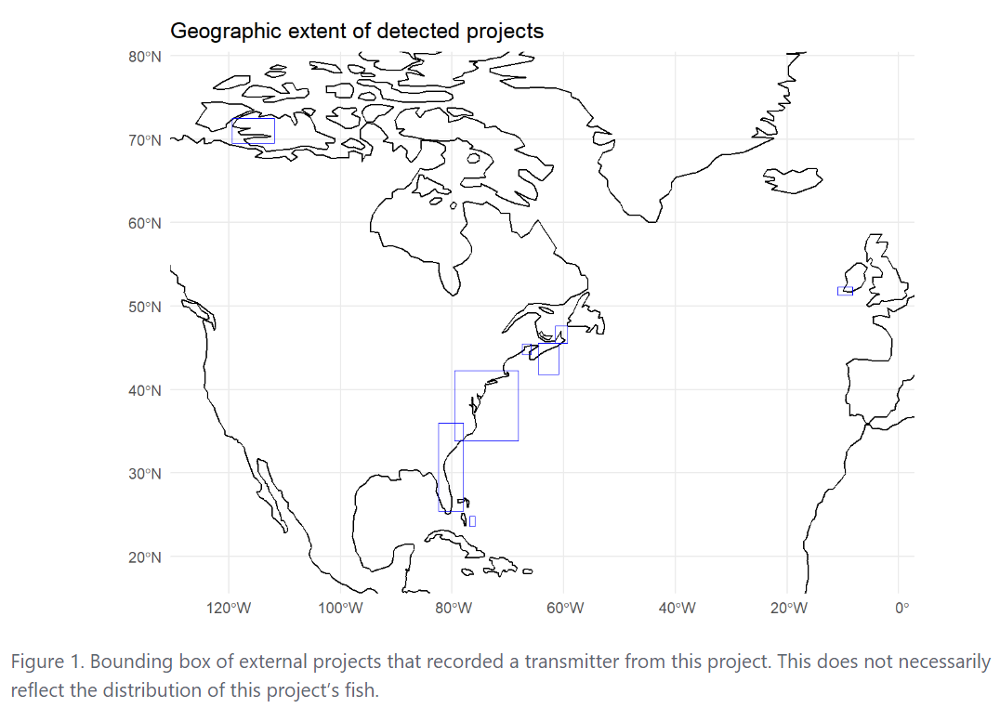
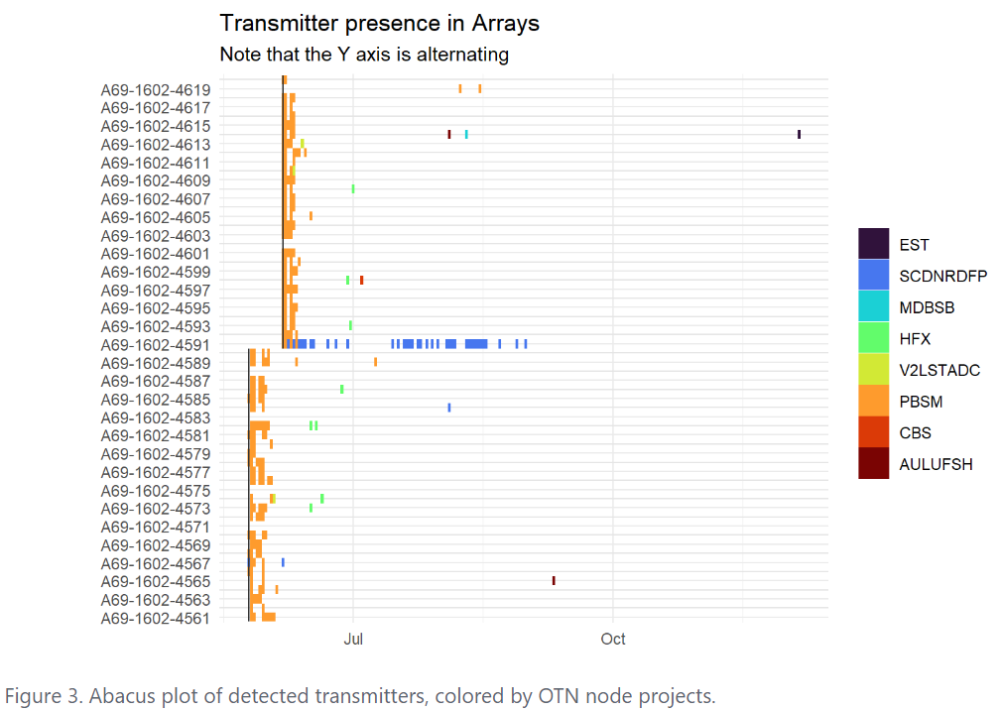
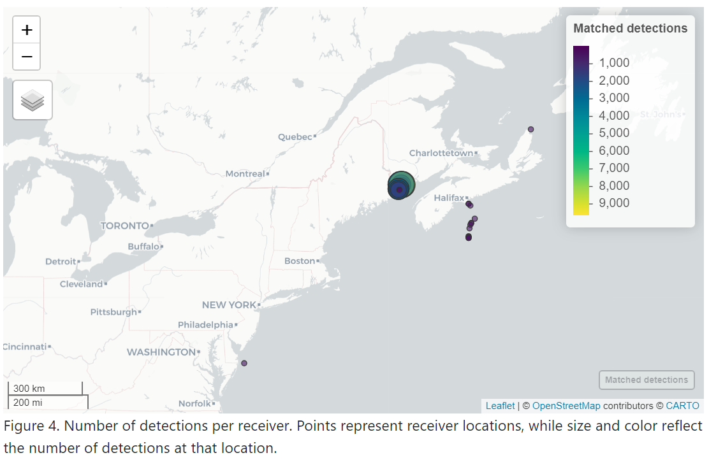
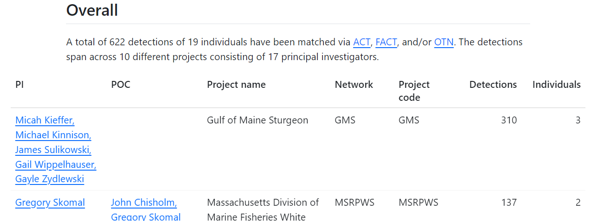
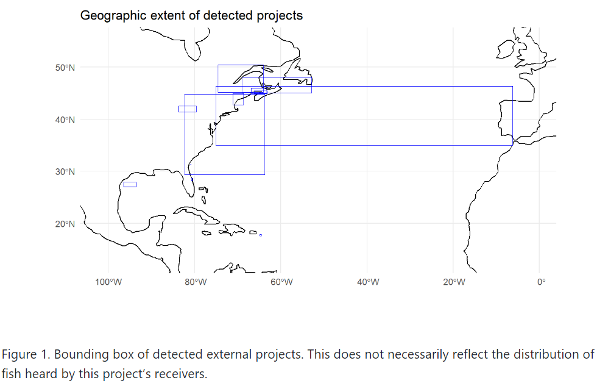
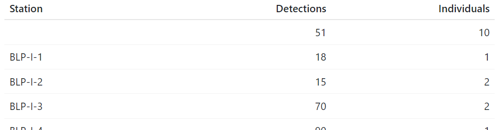
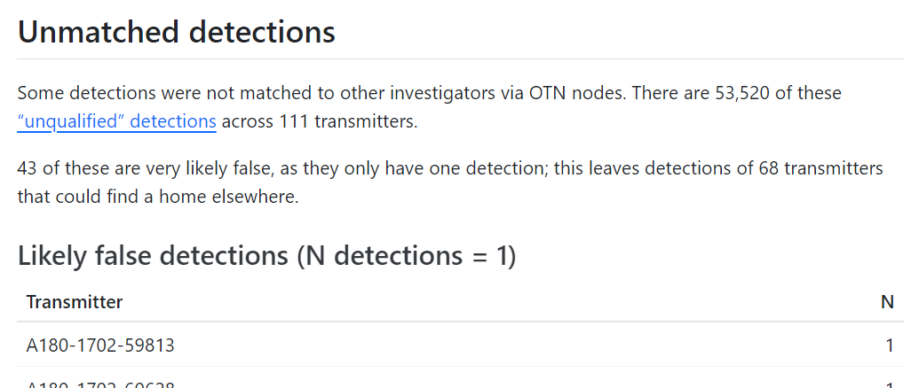

<!-- README.md is generated from README.Rmd. Please edit that file -->

```{r, include = FALSE}
knitr::opts_chunk$set(
  collapse = TRUE,
  comment = "#>",
  fig.path = "man/figures",
  out.width = "100%"
)
```

# otndo

<!-- badges: start -->
[](https://www.repostatus.org/#wip)
[](https://www.tidyverse.org/lifecycle/#experimental)

[](https://github.com/mhpob/otndo/actions/workflows/R-CMD-check.yaml)
[](https://mhpob.r-universe.dev/otndo)
<!-- badges: end -->

*entiendo* /ˌenˈtjendo/ [ˌẽn̪ˈt̪jẽn̪.̪o]\   
Spanish, 1st person indicative; "*I understand*"

***otndo*** /ˌoʊˈtjendo/ [ˌoʊ̪ˈt̪jẽn̪.d̪o]\
English, bad pun; "*I understand (OTN data)*"

The purpose of `otndo` is to provide a high-level summary of your acoustic telemetry transmitter matches from the Ocean Tracking Network, all while putting the "network" back in "tracking network" by noting the related projects and investigators.

## Installation

You can install the most-up-to-date version from [R-universe](https://mhpob.r-universe.dev/otndo) or [GitHub](https://github.com/mhpob/otndo).

R-universe:
```{r eval=FALSE}
install.packages(
  "otndo",
  repos = c(
    "https://mhpob.r-universe.dev",
    "https://cloud.r-project.org"
  )
)
```

GitHub:
```{r eval=FALSE}
# install.packages("remotes")
remotes::install_github("mhpob/otndo")
```

## Tag push summary example

This is a basic example of how you might use `otndo` to summarize your transmitter data:

```{r tag_push, eval=FALSE}
# Download some example data
td <- file.path(tempdir(), "otndo_test_files")
dir.create(td)

download.file(
  paste0(
    "https://members.oceantrack.org/data/repository/pbsm/",
    "detection-extracts/pbsm_matched_detections_2018.zip"
  ),
  destfile = file.path(td, "pbsm_matched_detections_2018.zip")
)
unzip(file.path(td, "pbsm_matched_detections_2018.zip"),
  exdir = td
)


# Make a tag push summary
library(otndo)

make_tag_push_summary(
  matched = file.path(td, "pbsm_matched_detections_2018.csv")
)
```

You will get a report in your working directory with a few goodies!

A summary of the number of matched individuals and detections by researcher and project:


The overall extent of the projects to which your tags have been matched:


When your fish were heard in each project:


The ever-ubiquitous "abacus plot", showing when each tag was heard, colored by project:


An interactive map showing detections by receiver:


A general estimate of the number of transmitters that were active at a given date:


## Receiver push summary example

This is a basic example of how you might use `otndo` to summarize your receiver data:

```{r rec_push, eval=FALSE}
# Download some example data

## Deployment metadata
download.file("https://members.oceantrack.org/data/repository/pbsm/data-and-metadata/2018/pbsm-instrument-deployment-short-form-2018.xls",
  destfile = file.path(td, "pbsm-instrument-deployment-short-form-2018.xls"),
  mode = "wb"
)

## Qualified detections
download.file("https://members.oceantrack.org/data/repository/pbsm/detection-extracts/pbsm_qualified_detections_2018.zip",
  destfile = file.path(td, "pbsm_qualified_detections_2018.zip")
)
unzip(file.path(td, "pbsm_qualified_detections_2018.zip"),
  exdir = td
)

## Unqualified detections
download.file("https://members.oceantrack.org/data/repository/pbsm/detection-extracts/pbsm_unqualified_detections_2018.zip",
  destfile = file.path(td, "pbsm_unqualified_detections_2018.zip")
)
unzip(file.path(td, "pbsm_unqualified_detections_2018.zip"),
  exdir = td
)


# Make a receiver push summary
make_receiver_push_summary(
  qualified = file.path(td, "pbsm_qualified_detections_2018.csv"),
  unqualified = file.path(td, "pbsm_unqualified_detections_2018.csv"),
  deployment = file.path(td, "pbsm-instrument-deployment-short-form-2018.xls")
)
```

A summary of the number of matched individuals and detections by researcher and project:



The overall extent of the projects associated with the tags your receivers have heard:



When your receivers heard each project's fish:


A Gantt chart of your receivers' deployments:


The number of detections and individuals per receiver:



An interactive map showing detections by receiver:


A summary of your unmatched detections, including those that are likely false...



...and those that may be real!


A summary of when the unmatched detections occurred, by receiver:


## Getting in contact

If something doesn't work the way it should or if you just need a little help, feel free to [open an issue on GitHub](https://github.com/mhpob/otndo/issues) or [email me (Mike O'Brien: obrien@umces.edu) directly](mailto:obrien@umces.edu).
