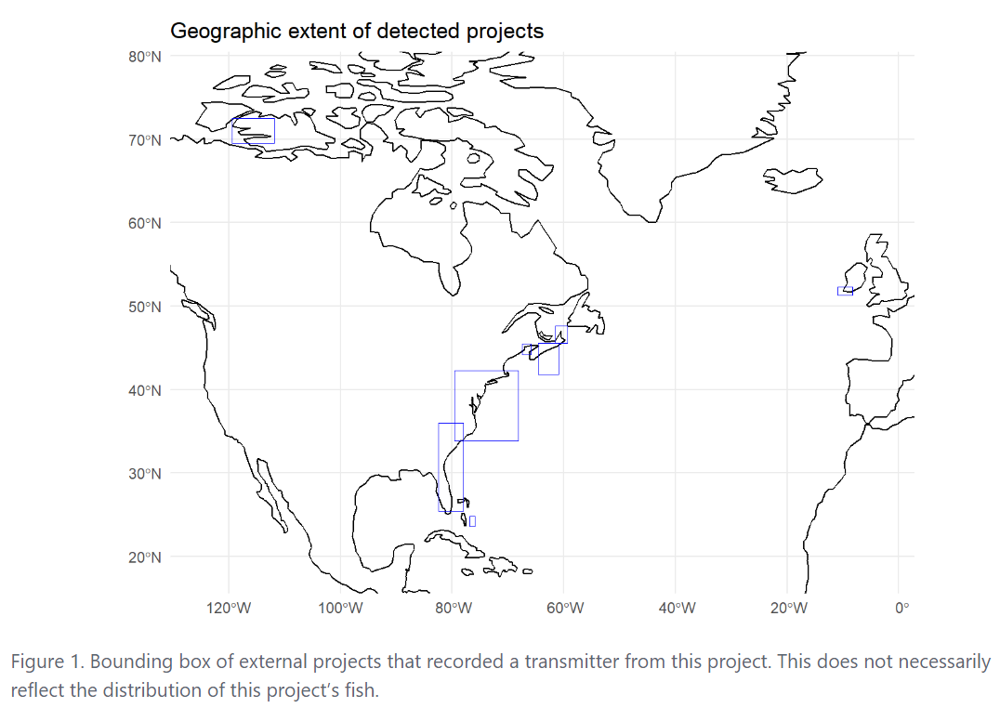
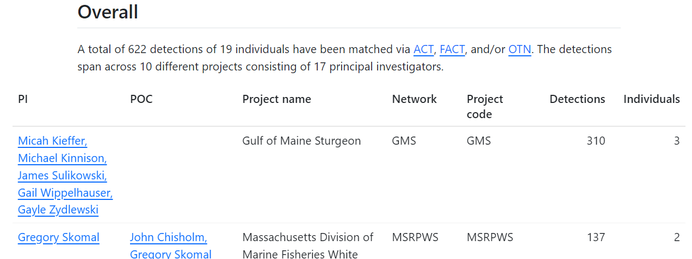
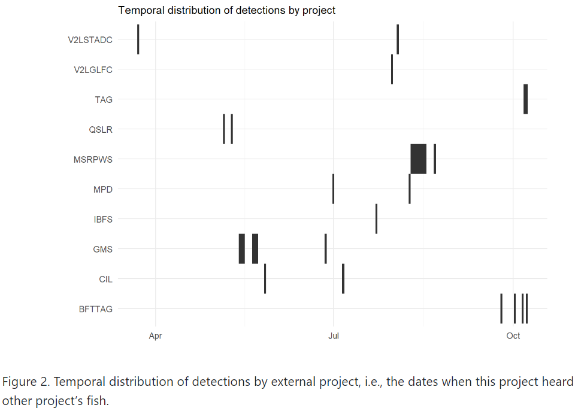
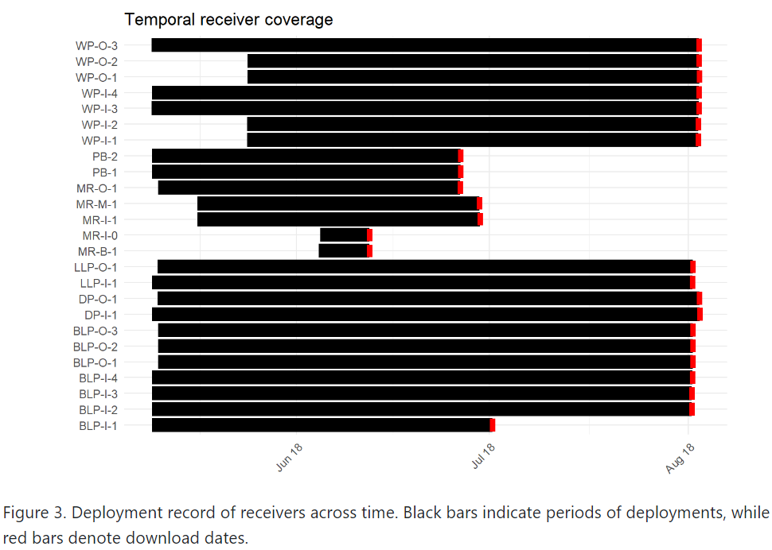
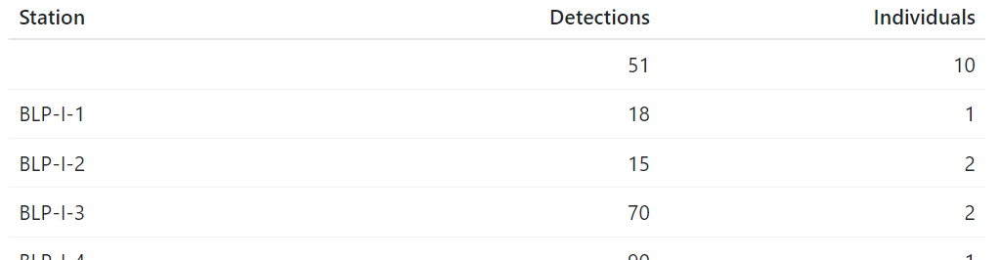
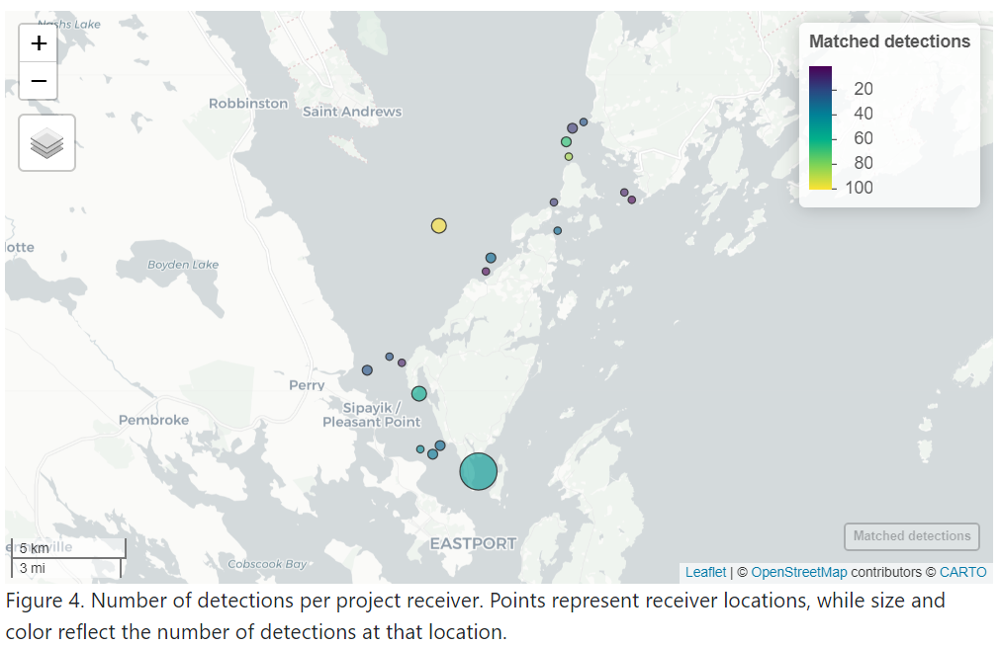
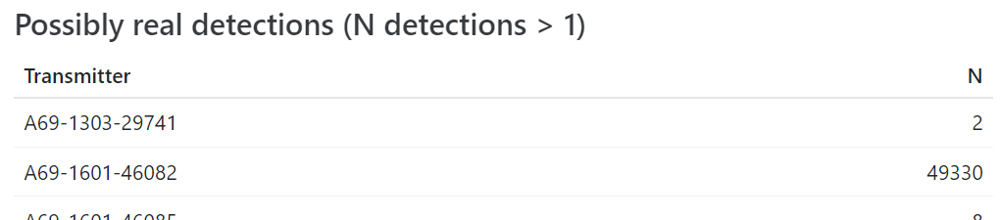

# otndo

*entiendo* /ˌenˈtjendo/ \[ˌẽn̪ˈt̪jẽn̪.̪o\]   
Spanish, 1st person indicative; “*I understand*”

***otndo*** /ˌoʊˈtjendo/ \[ˌoʊ̪ˈt̪jẽn̪.d̪o\]  
English, bad pun; “*I understand (OTN data)*”

The purpose of `otndo` is to provide a high-level summary of your
acoustic telemetry transmitter matches from the Ocean Tracking Network,
all while putting the “network” back in “tracking network” by noting the
related projects and investigators.

## Installation

You can install the most-up-to-date version from
[R-universe](https://mhpob.r-universe.dev/otndo) or
[GitHub](https://github.com/mhpob/otndo).

R-universe:

``` r
install.packages(
  "otndo",
  repos = c(
    "https://mhpob.r-universe.dev",
    "https://cloud.r-project.org"
  )
)
```

GitHub:

``` r
# install.packages("remotes")
remotes::install_github("mhpob/otndo")
```

## Tag push summary example

This is a basic example of how you might use `otndo` to summarize your
transmitter data:

``` r
# Download some example data
td <- file.path(tempdir(), "otndo_test_files")
dir.create(td)

download.file(
  paste0(
    "https://members.oceantrack.org/data/repository/pbsm/detection-extracts/",
    "pbsm_matched_detections_2018.zip/@@download/file"
  ),
  destfile = file.path(td, "pbsm_matched_detections_2018.zip"),
  mode = "wb"
)
unzip(file.path(td, "pbsm_matched_detections_2018.zip"),
  exdir = td
)


# Make a tag push summary
library(otndo)

make_tag_push_summary(
  matched = file.path(td, "pbsm_matched_detections_2018.csv")
)
```

You will get a report in your working directory with a few goodies!

A summary of the number of matched individuals and detections by
researcher and project:


The overall extent of the projects to which your tags have been matched:


When your fish were heard in each project:


The ever-ubiquitous “abacus plot”, showing when each tag was heard,
colored by project: 

An interactive map showing detections by receiver:


A general estimate of the number of transmitters that were active at a
given date: 

## Receiver push summary example

This is a basic example of how you might use `otndo` to summarize your
receiver data:

``` r
# Download some example data

## Deployment metadata
download.file(
  paste0(
    "https://members.oceantrack.org/data/repository/pbsm/data-and-metadata/",
    "archived-records/2018/pbsm-instrument-deployment-short-form-2018.xls/@@download/file"
  ),
  destfile = file.path(td, "pbsm-instrument-deployment-short-form-2018.xls"),
  mode = "wb"
)

## Qualified detections
download.file(
  paste0(
    "https://members.oceantrack.org/data/repository/pbsm/detection-extracts/",
    "pbsm_qualified_detections_2018.zip/@@download/file"
  ),
  destfile = file.path(td, "pbsm_qualified_detections_2018.zip")
)
unzip(file.path(td, "pbsm_qualified_detections_2018.zip"),
  exdir = td
)

## Unqualified detections
download.file(
  paste0(
    "https://members.oceantrack.org/data/repository/pbsm/detection-extracts/",
    "pbsm_unqualified_detections_2018.zip/@@download/file"
  ),
  destfile = file.path(td, "pbsm_unqualified_detections_2018.zip")
)
unzip(file.path(td, "pbsm_unqualified_detections_2018.zip"),
  exdir = td
)


# Make a receiver push summary
make_receiver_push_summary(
  qualified = file.path(td, "pbsm_qualified_detections_2018.csv"),
  unqualified = file.path(td, "pbsm_unqualified_detections_2018.csv"),
  deployment = file.path(td, "pbsm-instrument-deployment-short-form-2018.xls")
)
```

A summary of the number of matched individuals and detections by
researcher and project:



The overall extent of the projects associated with the tags your
receivers have heard:


When your receivers heard each project’s fish:



A Gantt chart of your receivers’ deployments:



The number of detections and individuals per receiver:



An interactive map showing detections by receiver:



A summary of your unmatched detections, including those that are likely
false…


…and those that may be real!



A summary of when the unmatched detections occurred, by receiver:


## Getting in contact

If something doesn’t work the way it should or if you just need a little
help, feel free to [open an issue on
GitHub](https://github.com/mhpob/otndo/issues) or [email me (Mike
O’Brien: obrien@umces.edu) directly](mailto:obrien@umces.edu).
